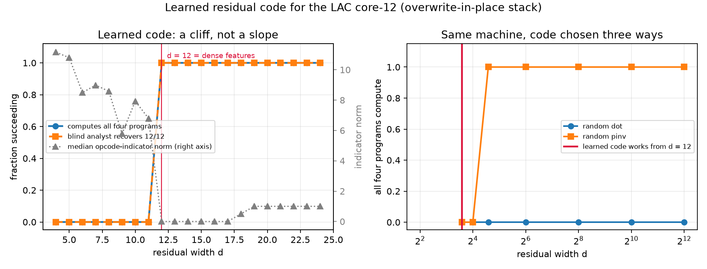

# Learned code (Version A): the machine refuses to superpose

`RESULTS.md` measured a machine whose residual code was drawn at random, and flagged
its own main weakness: a random code is a strictly weaker compressor than Tracr's
learned one, so every threshold there is an upper bound. This run replaces the random
code with one fit by gradient descent, following Tracr §5 — freeze every weight in the
machine, train only the embedding matrix.

Predictions registered in `PREDICTIONS-A.md` (commit `138aa9d`) before the trainer was
written.



## Headline

**A learned code compresses 24 features into 12 dimensions with zero behavioural loss,
and at `d = 12` it is not superposing anything.** The Gram matrix of the twelve dense
features is *exactly* the identity — `max|off-diagonal| = 0.00e+00` — and the twelve
opcode indicators have been driven to *exactly* zero norm. The compression is entirely
deletion: throw away the features nothing reads, keep the survivors orthogonal.

At `d = 11`, where sharing a direction would finally be forced, there is no graceful
degradation. Every program stops computing, the analyst recovers nothing, and the Gram
off-diagonals blow up to 13.8. The curve is a cliff, not a slope.

Untying the readout from the code (Tracr uses a shared `W`; freeing `R` doubles the
parameters) changes none of it — same cliff at 12, same exact orthogonality above it.
So this is a fact about the machine, not about Tracr's convention.

## Same machine, code chosen three ways

All on the overwrite-in-place stack, all four oracle programs required to return their
exact values:

| code | smallest `d` that computes all four |
|---|--:|
| random, `dot` readout | none up to `d = 4096` (only `countdown_5` ever works, 0.70 of seeds at 4096) |
| random, `pinv` readout | 24 — exactly the rank condition, nothing to do with compression |
| **learned** | **12** |

The learned code halves the best random code's requirement, and does at `d = 12` what a
random `dot` code fails to do at 340× the width.

## Grading

**A1 — REFUTED on the number, confirmed in direction.** I predicted `d` = 6 to 8, from
counting features that are ever simultaneously non-zero in one vector: 6 for a ROM row,
5 for a stack row, 4 for a query. Measured `d*` = 12, which is the count of *dense
features overall*, not the per-row-type maximum. The grading rule I fixed in advance
said "confirmed if at most 8, and below the dense feature count" — 12 is neither.

The reasoning was wrong in an instructive way. Disjointness in the *encoding* buys
nothing when the *readout* is shared. `prog_k0` and `stack_k0` never co-occur in a row,
but the single readout vector for `prog_k0` must return its value on ROM rows *and*
return zero on stack rows. Two features that never co-occur still cannot share a
direction if one linear readout has to be selective between them.

**A2 — CONFIRMED, more strongly than stated.** I predicted the twelve `op_*` indicators
would be discarded, with norms at least an order of magnitude below the rest. They go to
exactly 0.0000 for every `d ≤ 17`, against 1.000 for the dense features. Nothing in the
compiled machine reads them and the current analyst does not either, so the optimizer
deletes them the moment the room is needed — the same behaviour Tracr reports for
`tokens:a/b/c`.

**A3 — REFUTED, and this is the substantive correction to `RESULTS.md`.** I predicted
`value` would be a wall that learning could not move, because its magnitudes reach 5050
against an absolute tolerance of 0.25. `sum_1_to_100` computes perfectly under the
learned code at every `d ≥ 12`, while under a random code it computed at *no* width
tested, up to 16384. Dynamic range is a wall for a random code and not for an optimized
one, because the optimizer can put `value` on its own axis instead of leaving it to
collide with everything at `1/sqrt(d)`.

`RESULTS.md` concluded that "capacity is set by the largest number the computation holds,
and it cannot be normalized away". The first half stands only for random codes. It
cannot be *normalized* away — the post-hoc `scaled` arm showed that — but it can be
*optimized* away completely.

**A4 — CONFIRMED.** Under random codes the analyst kept recovering the ISA at widths
where the machine had stopped computing. Here the two thresholds are identical: both
compute and 12/12 recovery appear at `d = 12` and both vanish at 11. A code trained to
preserve exactly the margins the machine needs preserves exactly the structure the
analyst reads.

## The `1e-6` tiebreak is not compressible at all

Training on the original append-only stack is ill-posed, and finding out why sharpened
P3 from `RESULTS.md`. Of 18,995 margin constraints, 11,118 are same-address pairs
separated only by `key_1`'s `1e-6` write-order term. At their true target they generate
no gradient — the optimizer satisfied the loss to 0.004 while inverting 97% of them — and
normalized to matter they carry a `1e6` weight and own the objective outright. There is
no weighting that works, because the machine is asking for a decision margin five orders
of magnitude finer than every other decision it makes.

`PREDICTIONS.md` registered the response in advance: switch the stack to
overwrite-in-place keyed on address. That variant computes all four programs exactly
(`run(..., overwrite=True)`), every score gap becomes ≥ 1, and training becomes
well-posed. P3 said the tiebreak dies first under compression; the stronger statement is
that you cannot even *fit* a code that preserves it.

## Leakage check, run as pre-registered

`PREDICTIONS-A.md` fixed the rule before the result existed: the code is trained on the
same programs it is scored on, so a success obliges a held-out re-run. Done — for each
of the four programs, a code trained on the other three, at `d = 12`:

| held out | computes all four at `d = 12` |
|---|---|
| `sum_1_to_15` | yes, including the held-out one |
| `countdown_5` | yes |
| `rot_jz_nop` | yes |
| `sum_1_to_100` | yes |

Consistent with the mechanism: the code is doing feature selection, not fitting values.

## Why the optimizer needed continuation, and why that matters

Training from a random initialization does not find the optimum even where one provably
exists. At `d = 24` the identity code scores exactly 0 on this objective; random-init
Adam plus L-BFGS plateaus around 20% violated margins with five times the iteration
budget. A threshold read off that would have been a fact about the optimizer.

So the codes are fit by continuation: start at `d = 24` with the identity (zero loss by
construction), and to go from `d` to `d-1` project onto the code's own top-(`d-1`) right
singular subspace and retrain. Each step starts from a solved problem one dimension
away. This is why `d*` = 12 is a claim about reachable codes rather than about Adam.

It is still a lower bound on compressibility: continuation from the identity may not
find the global optimum either, and a different scheme could conceivably reach 11 or
fewer. What it cannot do is invalidate the structural finding — at every `d ≥ 12` the
solution found is *exactly* orthogonal, which is the strongest form the answer could
take.

## What this says about the original question

The line started from a real objection: blind ISA recovery worked on the compiled
machine only because its features are axis-aligned, and trained networks superpose, so
the result should not transfer. This experiment tried to add superposition and found
that the machine will not accept it. Offered a free choice of code and 12 spare
dimensions, gradient descent declines to superpose anything, deleting unread features
instead, and the moment genuine sharing is forced the machine stops working entirely.

The tentative reading, stated at the width it deserves: exact sequential computation of
this kind — hard argmax, a fixed decision margin of 1, hundreds of steps compounding —
appears incompatible with feature sharing. Trained networks do superpose. So either they
are not doing this kind of computation, or they are doing it with an error tolerance this
machine does not have. Both readings weaken the original hope that LAC's recoverability
transfers, and neither is established by one ISA, 24 features, and one training scheme.

Tracr's `frac_prevs` compresses 14 features into 6 and reports its index embeddings
sitting in non-orthogonal directions — genuine superposition among the survivors. This
machine shows none at any width where it works. The difference Tracr's own paper points
at is the one that matters here: a fixed-depth feed-forward program versus a stateful
machine iterating one weight set for hundreds of steps.

## Files

| file | what it is |
|---|---|
| `PREDICTIONS-A.md` | A1–A4, registered before the trainer was written |
| `learned.py` | constraint harvest, objective, continuation training |
| `eval_learned.py` | runs the learned codes through the same machine and analyst |
| `probe_learned.py` | Gram-matrix structure and the held-out leakage check |
| `plot_learned.py` | generates `learned_curves.png` |
| `learned_results.json` | per-`d` compute, recovery and code geometry |
| `random_overwrite.json` | random codes on the same overwrite machine, for comparison |

```bash
cd experiments/superposition
OMP_NUM_THREADS=1 python3 eval_learned.py     # ~5 min
OMP_NUM_THREADS=1 python3 probe_learned.py    # ~12 min, includes the held-out runs
python3 plot_learned.py
```

## Projection rule

The ALTA replication (`oaustegard/experiments`, `alta-superposition/`, 2026-09-06)
found that the rule used to drop a dimension inside the continuation decides whether
survivors share directions: projecting onto the code's own top singular subspace, the
rule above, gave orthogonal survivors and a cliff at the live count on every ALTA
program, while projecting onto the code's image of the visited states let every
program compress below live with shared directions. The LAC run was repeated with
the second rule (`eval_learned.py --projection data`, output
`learned_results_data.json`, same objective, same widths, same machine).

| rule | smallest working `d` | Gram off-diagonal of the dense features at working widths | opcode indicators at `d` = 12 |
|---|--:|--:|--:|
| code SVD (August) | 12 | 0.00e+00 | exactly 0 |
| trajectory SVD | 11 | 0.37 to 0.44 (transfer 0.27 to 0.30) | median norm 0.09, tapering from 0.93 at `d` = 21 |

Under the trajectory rule the machine computes all four programs and the analyst
recovers 12 of 12 at every width from 24 down to 11, with the twelve dense feature
directions non-orthogonal from `d` = 21 downward. The claim above that the
compression is deletion throughout and that the survivors stay exactly orthogonal is
withdrawn: it described the projection rule, and a different rule produces a shared
code that runs the same programs.

What the rerun leaves standing is the amount. One dimension is gained, 12 to 11,
where ALTA's SUBLEQ gained 26 of 121 and its parity programs 14 of 31 and 2 of 7.
The LAC-specific candidate for that gap is unchanged: the machine holds integers up
to 5050 and reads them against a tolerance of 0.5, so any shared direction costs
absolute error that ALTA's bucketed values in [-16, 16] never pay. The rerun does not
test that; it removes the other explanation.
