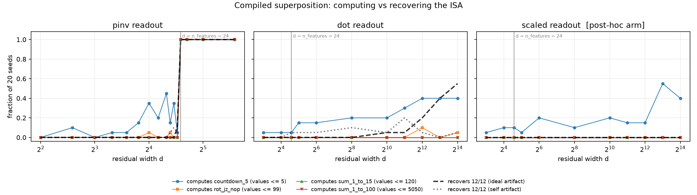

# Compiled superposition: computing vs recovering the ISA

The blind-recovery result in `experiments/blind_recovery/` reconstructed LAC's core-12
ISA exactly from permuted tensors, but only because the compiled residual stream is
axis-aligned: 51 dims, 24 used, orthogonal, zero interference. This experiment replaces
that basis with a random code — each of the 24 semantic features gets a random unit
vector `u_f` in `R^d`, and a row embeds as `sum_f value_f * u_f` — and measures two
things across `d`: whether the machine still computes, and whether a blind analyst can
still recover the instruction set.

Read `DELTA.md` first. Tracr §5 (Lindner et al., arXiv 2301.05062) already uses compiled
transformers to study superposition; that file states what is theirs and what is left.

Predictions were registered in `PREDICTIONS.md` before any code was written
(commit `dad0fb1`), and the Tracr delta before the sweep ran (commit `e25eeb4`).



760 configurations, 20 seeds each. Full tables in `results_tables.md`, raw data in
`results.json`.

## Headline

**The ISA outlives the machine.** Under the `dot` readout at `d = 16384`, the blind
analyst recovers all twelve opcodes exactly in 55% of seeds. At that same width
`sum_1_to_15` and `sum_1_to_100` compute in zero seeds — as they do at every width under
a random code — and `rot_jz_nop` computes in one. Structure survives compression that
behaviour does not.

**What breaks is dynamic range, not feature count.** All four programs run on the same
24 features and the same weights. The only thing separating them is the size of the
numbers they hold, and that alone orders the results: `countdown_5` (values ≤ 5) is the
only program that computes with any regularity anywhere, `sum_1_to_100` (≤ 5050) never
computes and diverges at step 0.

## P1 — recovery survives deeper compression than computation: CONFIRMED

The grading rule was that the recovery curve must extend to more aggressive compression
than the compute curve. On the `dot` arm it does, by a margin the grid cannot even
bound:

| d | computes `sum_1_to_15` | computes `sum_1_to_100` | recovers 12/12 |
|--:|--:|--:|--:|
| 1024 | 0.00 | 0.00 | 0.05 |
| 4096 | 0.00 | 0.00 | 0.20 |
| 8192 | 0.00 | 0.00 | 0.40 |
| 16384 | 0.00 | 0.00 | 0.55 |

The `pinv` arm shows the same sign at its cliff: at `d = 23`, three of the four programs
compute in zero seeds and `countdown_5` in one, while the analyst returns 12/12 in two.

The mechanism is a difference in how many exact decisions each side has to get right.
The machine needs a correct hard argmax and a correct quantized read at *every step* —
803 of them for `sum_1_to_100`, over a memory it wrote itself that grows past 1500 rows.
The analyst decodes a fixed, small evidence set — three ROMs and eight memory snapshots
— and then runs the recovered machine in its own arithmetic interpreter, where there is
no residual stream to be noisy. One flipped argmax anywhere kills the machine; the
analyst has no argmax to flip.

**The qualification is real and is the reason the sweep measures two artifacts.** The
`ideal` artifact hands the analyst the reference trajectory re-encoded in the packed
basis: the states a working machine would hold. The `self` artifact hands it what this
packed machine actually produced. Recovery from `self` peaks at 0.20 and falls to ~0 at
large `d`, because at those widths the machine's own traces are traces of a malfunction,
and no correct ISA reproduces them. So the honest claim is narrower than "the ISA is
recoverable": *the ISA remains readable out of a compressed representation long after
the machine stops executing, provided the activations come from a machine that was
working.* Compress the representation of a working computation and the program is still
there; compress the machine until it breaks and its own traces stop being evidence about
anything.

## P2 — capacity is set by dynamic range, not feature count: CONFIRMED

The prediction was that the parabolic winner/runner-up gap is exactly 1 (score at `j=x`
is `x²`, at `j=x±1` it is `x²-1`) while interference scales as `stored_value / sqrt(d)`,
so a program holding larger numbers should break at far larger `d`.

Feature count is constant at 24 across all four programs. Maximum stored value is not,
and it orders the outcomes exactly. (Compute rates below are the best over the `dot` and
`scaled` arms at any width — the `pinv` arm is excluded here because above `d = 24` it is
exact by rank and computes everything, which says nothing about compression.)

| program | max value | best compute rate under a random code | median first-divergence step (dot, d ≥ 1024) |
|---|--:|--:|--:|
| `countdown_5` | 5 | 0.55 | 3 |
| `rot_jz_nop` | 99 | 0.10 | 4 |
| `sum_1_to_15` | 120 | 0.00 | 4 |
| `sum_1_to_100` | 5050 | 0.00 | 0 |

The quantitative form holds too. Absolute readout error under a random code is about
`||y|| / sqrt(d)`, and the machine needs it under 0.5 (the quantizer) and under 1 (the
key gap), so the width required scales as the square of the largest magnitude in a row.
For `countdown_5` that predicts `d` in the hundreds-to-low-thousands, and its compute
rate does climb from 0.05 at `d = 8` to 0.40 by `d = 4096`. For values near 100 it
predicts tens of thousands, and both programs in that band sit at ~0 across the whole
grid. For 5050 it predicts `d ~ 10^8`, and that program diverges on the first step at
every width tested.

**The post-hoc `scaled` arm makes the same point from the other side, and was the
surprise.** Dividing each feature's direction by that feature's typical magnitude
flattens *relative* error across features, and the expectation was that it would move
the threshold by orders of magnitude. It does not. It helped only the program whose own
numbers are small — `countdown_5` reaches 0.55 at `d = 8192`, the best compute rate in
the whole dot/scaled family — and left every other program at zero, while pushing
`value_drift` from 8% of failures to 48% and dropping recovery to zero everywhere.

The reason is that scaling is zero-sum against an absolute tolerance. Shrinking a
feature's embedding direction by `s_f` shrinks its contribution to everyone else's
interference, but multiplies its *own* absolute readout error by `s_f`. The machine does
not need small relative error; it needs absolute error under a fixed gap of 1, on every
feature at once. With `value` carrying a typical magnitude of 2147, no allocation of
directions buys that. Capacity here is set by the largest number the computation holds,
and it cannot be normalized away.

## P3 — the `1e-6` recency tiebreak dies first: PARTIALLY CONFIRMED

The prediction was that `key_1 = -addr² + 1e-6 * write_order` carries the smallest signal
in the system, so append-only stack semantics should break before addressing does, at
essentially any `d`.

The ordering is real but conditional on `d`, and the direction is closer to *last* than
*first*. Where the residual stream is wide enough for addressing and opcode decode to
survive — the `dot` arm at `d ≥ 1024`, on programs whose values are small — the
tiebreak is the dominant remaining failure: it accounts for 68% of `countdown_5`'s first
divergences and 34% of `sum_1_to_15`'s, in each case the argmax moving to another row at
the *same* address, which only the `1e-6` term separated. Across the `dot` arm as a
whole it is 18% of failures.

But it is not what breaks first in absolute terms. At small `d`, and for
high-dynamic-range programs at any `d`, the machine loses the ROM argmax or misrounds
the opcode long before the stack tiebreak matters — `sum_1_to_100` fails on
`opcode_decode` in 54% of runs, at step 0. So the tiebreak is the binding constraint in
the regime that survives everything else, not the first thing to go.

The contingency P3 attached — if everything appears broken even at large `d`, switch the
stack to overwrite-in-place and re-run — was not needed: `pinv` at `d ≥ 24` computes all
four programs in all 20 seeds, tiebreak included.

## The `pinv` cliff

Worth stating because it is the one non-gradual result. The pseudo-inverse readout is
exact whenever the code has full column rank, which for `d ≥ 24 = n_features` it does,
so everything works perfectly at 24 and above — all four programs, all seeds, recovery
12/12 — and collapses immediately below. There is no compression gradient under `pinv`;
there is a rank condition. The gradual behaviour the experiment is about lives entirely
in the `dot` arms.

## What would change these numbers

**The analyst is a lower bound, and it was tuned against pilot data.** The recovery
curve is a property of *this* analyst, not of recoverability. Four of its stages were
strengthened after watching them fail on pilot configurations: decoding each address
jointly from both projected coordinates rather than rounding one; constraining a ROM's
addresses to be a permutation and solving the assignment; reading `ip`/`sp` straight off
a head's own query projection instead of taking an argmax over rows; and replaying the
recovered machine arithmetically rather than through the packed weights. That last
change is the one that made P1 testable at all — replaying through the weights made
recovery inherit the machine's own per-step fragility, which decides P1 by construction
rather than by measurement. Two smaller additions are also post-hoc: comparing snapshot
values as floats rather than forcing a hard integer decode, and handing the replay a
short list of alternates for ROM rows whose readout did not land cleanly on an integer.
A stronger analyst — sparse dictionary recovery over the ROM rows, which Tracr names as
the reverse-superposition direction — would push the recovery curve further left.

**The compressor is a lower bound too.** A random frozen code is weaker than Tracr's
learned projection, which both discards features the task does not need and re-encodes
the ones it keeps. Every `d` here is an upper bound on what this ISA needs, not a
capacity limit of the ISA. See `DELTA.md`.

**One measurement decision was tested and reversed.** Aborting a run at the first step
where it left the reference trajectory looked like a free optimization. The audit
(`python3 sweep.py --audit`) flipped 4 of 192 verdicts, every one a `countdown_5` run
that diverged and still landed on the right answer, so the abort was removed and the
final sweep never truncates. It cost about 20 minutes of compute and would have biased
the one program carrying the P2 signal.

## Files

| file | what it is |
|---|---|
| `PREDICTIONS.md` | P1–P3, registered before any code |
| `DELTA.md` | what Tracr §5 does, what is left, what must be cited |
| `packed.py` | the packed compiler: codebook, readout arms, executor, artifact emitter |
| `analyst_sp.py` | the superposition-aware blind analyst |
| `sweep.py` | the sweep driver, plus the divergence audit |
| `tables.py` | generates `results_tables.md` from `results.json` |
| `plot_curves.py` | generates `curves.png` |
| `results.json` | raw sweep output, 760 configurations |

Reproduce with:

```bash
cd experiments/superposition
OMP_NUM_THREADS=1 python3 sweep.py --seeds 20 --procs 4   # ~35 min on 4 cores
python3 tables.py > results_tables.md
python3 plot_curves.py
python3 sweep.py --audit
```

The four oracle programs and the dispatch tensors are imported unchanged from
`experiments/blind_recovery/compile_artifact.py`, which stays the correctness oracle.

## One deviation from the axis-aligned machine, flagged

The compiled machine tests `va == 0` for its conditional jumps — an exact float
comparison it gets away with because an axis-aligned basis hands it exact integers.
Under any superposition that test fails at machine epsilon, at every `d`, which would
make every arm fail identically and leave nothing to measure. The packed executor
therefore re-digitizes every scalar it reads out of the residual stream by rounding to
the nearest integer, matching what the original already did for the opcode
(`int(round(opv))`) and the jump target. `run(..., quantize=False)` measures what that
assumption buys.
