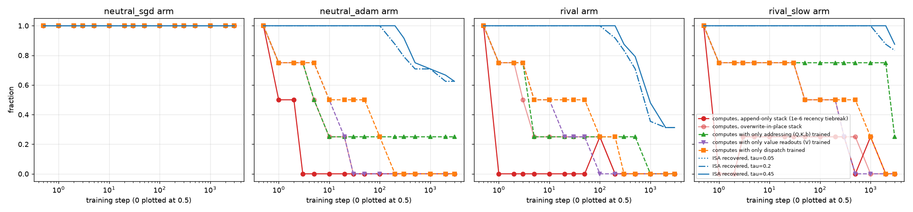

# Compiler as a training monitor: how long does a compiled ISA stay readable under SGD?

Start a transformer at the compiled LAC core-12 weights, train it with ordinary
gradient descent and no circuit-preservation term, and ask two questions at every
checkpoint: does the machine still compute, and can an analyst still read the
instruction set out of the weights? Predictions were registered in `PREDICTIONS.md`
(spec of 2026-08-11) before any code here existed. Run on 2026-09-05, CPU, one seed.

## Headline

**Recoverability outlives correctness by two orders of magnitude in weight distance.**
Under the `rival` arm, every one of the four oracle programs has stopped computing
within 30 to 200 steps, at an L2 distance from the compiled point below 0.1 per
component. The analyst still recovers the full 12-opcode ISA, all six heads, and a
replay that reproduces every captured memory snapshot, at step 200 and L2 ≈ 1.0. The
first opcode is lost at step 300 (L2 ≈ 1.5). The slow arm (lr 1e-4) moves the same
transitions to steps 1000 and 3000 at the same L2 values, so the threshold is a
distance in weight space of about 1.0 per component.

What breaks correctness first is any leakage of the `value` column into a key or a
readout: the machine holds integers up to 5050 and reads them with an absolute
tolerance of 0.5, so a coefficient error of 1e-4 is already fatal on the summation
programs. What the analyst reads is the half-integer lattice the compiler wrote, and
thresholding at 0.45 sees it intact until the drift reaches the lattice spacing.

## Setup

- **Machine.** The numpy compiler of `experiments/blind_recovery` (six heads, dispatch
  entirely in tensors), re-expressed in torch with softmax attention at key scale
  β = 20 so every parameter carries gradient. Upstream `executor.CompiledModel` was not
  used: its forward hard-codes every opcode in Python and has no dispatch gradient.
  `test_machine.py` pins the parameter dict and the executor to the blind-recovery
  compiler on all four programs. Step-0 soft-forward error against the reference reads:
  opcode 0, immediate 2e-7, stack reads 1e-5.
- **Data.** Teacher-forced: 958 (query, memory, targets) steps harvested from the four
  oracle programs, overwrite-in-place memory (a softmax cannot resolve the 1e-6 recency
  tiebreak, as `../superposition/RESULTS-A.md` found).
- **Arms.** `neutral_sgd`: the machine's own task, plain SGD, lr 1e-8. `neutral_adam`:
  same task, AdamW lr 1e-3. `rival`: targets from a rival ISA (dispatch rows cyclically
  shifted by one, stack reads at SP-1..SP-3), AdamW lr 1e-3. `rival_slow`: lr 1e-4.
  `random`: same architecture from random init on the neutral task, the realism
  reference. Weight decay 1e-2 throughout, batch 128, 3000 steps, checkpoints at
  0, 1, 2, 3, 5, 10, 20, 30, 50, 100, 200, 300, 500, 1000, 2000, 3000.
- **Correctness.** The four oracle programs (5050 / 120 / 0 / 1), run by the hard-argmax
  executor with read scalars re-digitized to integers, on both the append-only stack of
  the spec and the overwrite-in-place stack. A component-isolation variant runs the
  compiled machine with only one of addressing (Q, K, b_Q), value readouts (V), or
  dispatch taken from the trained weights.
- **Recoverability.** `analyst_tol.py`: threshold every weight at τ, snap survivors to the
  half-integer lattice, score the snapped machine against the compiled one with partial
  credit per opcode (Δsp 0.25, control 0.25, write coefficients 0.5) and per head (Q, K,
  V, b each 0.25), then replay the snapped machine on the three reference ROMs and
  require every captured memory snapshot to be reproduced exactly, searching the 12
  cyclic opcode-to-row alignments as the blind analyst did. τ is swept over
  {0.05, 0.1, 0.2, 0.3, 0.45}. An all-zero machine scores 0.27 on the ISA and 0.17 on
  addressing, which is the floor to read the tails against.

## Numbers

| arm | first program fails (overwrite) | all fail (overwrite) | last 12/12 recovery | first opcode lost | ISA / addr at 3000 |
|---|--:|--:|--:|--:|--:|
| neutral_sgd, lr 1e-8 | never | never | 3000 | never | 1.00 / 1.00 |
| neutral_adam, lr 1e-3 | 1 | 30 | 200 (L2 1.19 / 0.91) | 300 (L2 1.79 / 1.36) | 0.62 / 0.79 |
| rival, lr 1e-3 | 1 | 200 | 200 (L2 0.98 / 0.81) | 300 (L2 1.52 / 1.33) | 0.31 / 0.83 |
| rival_slow, lr 1e-4 | 1 | 1000 | 2000 (L2 1.06 / 0.94) | 3000 (L2 1.52 / 1.41) | 0.88 / 0.92 |

L2 is (heads / dispatch). On the append-only stack every arm except `neutral_sgd` fails
at step 1: the recency tiebreak is a 1e-6 signal and any leakage of `value` into the
stack key swamps it. The overwrite-in-place columns are the structural measurement.

Order of loss in the `rival` arm at τ = 0.45: ADD, SUB and JNZ at step 300; PUSH and
SWAP at 500 along with the `prog_arg`, `stack_a`, `stack_b` heads (the immediate readout
and the two stack reads the rival ISA moves); ten of twelve opcodes by 1000; all twelve
by 2000, with `prog_op` the last head to go. Addressing structure is still 0.83 at step
3000, against the 0.17 floor, while the ISA score sits at the 0.27 floor. The rival task
pushes hardest on exactly the components that die first.

## Grading

**P1, overshadow not erase: confirmed.** Correctness is gone by step 30 (`neutral_adam`)
or 200 (`rival`); full recovery holds to step 200 in both and to step 2000 in
`rival_slow`. In weight distance, correctness dies below L2 0.1 and recovery survives to
L2 1.0. The analyst reads structure that the machine can no longer use. The fine-tuning
literature inferred this from a mechanism it had only hypothesized; here the mechanism
was compiled, so the comparison is between a known start point and its trained image.

**P2, dispatch dies before addressing: confirmed for recoverability, refuted for
correctness.** As structure, yes: at step 3000 the `rival` addressing score is 0.83 and
the dispatch score is at floor. Q, K and b_Q entries are 0, ±1, ±2 on a 51-wide row, and
the snap-and-threshold sees them long after the dispatch coefficients have drifted past
the half-integer boundary. As behaviour, no: the component-isolation runs show
addressing-only drift breaking three of four programs by step 5 in `rival`, at the same
time as value-readout-only drift, while dispatch-only drift keeps two programs running
to step 100. The parabola's margin of 1 is a margin against perturbations of the key
*columns it uses*; a 1e-4 leakage of the `value` column into W_K adds 0.5 to a score
when the value is 5050 and flips the argmax. The August superposition run put it as
capacity ∝ (largest magnitude)², and it holds here with a trained perturbation instead of
a random code. The two small-value programs (`countdown_5`, `rot_jz_nop`) are the ones
that survive longest under every isolation.

**P3, cliff in correctness, slope in recoverability: confirmed.** Correctness goes
1.00, 0.75, 0.25, 0 across five checkpoints in `rival` (steps 0 to 200). Recovery goes
1.00, 0.92, 0.83, 0.71, 0.35, 0.31 across steps 200 to 3000, and the τ sweep spreads
it further (τ = 0.45 holds 12/12 fifty percent longer than τ = 0.05 in `neutral_adam`).

## Two findings not in the predictions

**Adam's first step is not small.** The `neutral_adam` arm starts at loss 4.6e-11 and
one Adam step at lr 1e-3 takes it to 8.2e6, with one of four programs already failing
on the overwrite stack and two on the append-only one. Adam normalizes the gradient, so
a 1e-11 loss still produces a full lr-sized step on every parameter that has any
gradient at all. The spec assumed the neutral arm would move only by weight decay and
optimizer noise; that holds for plain SGD (lr 1e-8: no change in 3000 steps) and not for
Adam. SGD at lr 1e-3 diverged in three steps instead, because the MSE curvature on
values near 5050 needs lr below 1e-7. A drift control on a compiled machine has to name
its optimizer.

**Training from the compiled point does not make the weights realistic.** The
Wasserstein distance between the pooled |weight| distribution and the random-init
model's moves from 0.109 to 0.086 over 3000 steps; sparsity goes from 0.97 to 0.86,
against 0.03 for the random-trained model. InterpBench's motivation for a
preservation-and-realism loss stands: plain training from a compiled start destroys the
circuit long before it produces natural-looking weights. The random-init model, for its
part, never learned the machine (0 of 4 programs at 3000 steps; ISA score 0.50 against a
0.27 floor, addressing at floor). Phases 5 to 9 of this repo found the same.

## Delta vs prior art

InterpBench (SIIT) and Tracr-Injection both train around a compiled circuit with a loss
that holds it in place and report the endpoint. This run drops the preservation term and
measures the path: correctness dies first, at L2 below 0.1; the structure stays readable
to L2 about 1.0; dispatch structure goes before addressing structure; and the analyst's
threshold sets how much of that gap it can see. Tracr-Injection's own limitation, that the
model stops using the injected variables far outside the training distribution, is the
correctness half of this curve measured from the other end.

## Limits

One seed, one machine, one learning-rate pair. The rival task is a permutation of the
same ISA, chosen to put gradient on every component rather than to be realistic. The
analyst is structural (snap and compare) rather than blind, which is the right tool for
a decay curve and would not, on its own, discover an unknown machine. The realism
proxy is a one-dimensional distance between weight histograms and says nothing about circuits.
